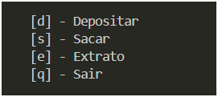

# sistema_bancario_python

Trabalho do curso de engenharia de dados com python simulando um sistema bancario com operações simples

Modo de uso: 

Windows

para melhor utilização instalar os frameworks usando o comando `pip install -r requirements.txt`

depois disso na pasta raiz usar o comando `python .\main.py`

escolher a opção desejada sendo que o saldo sempre começa em 0.

depois disso só seguir os comandos do software.
